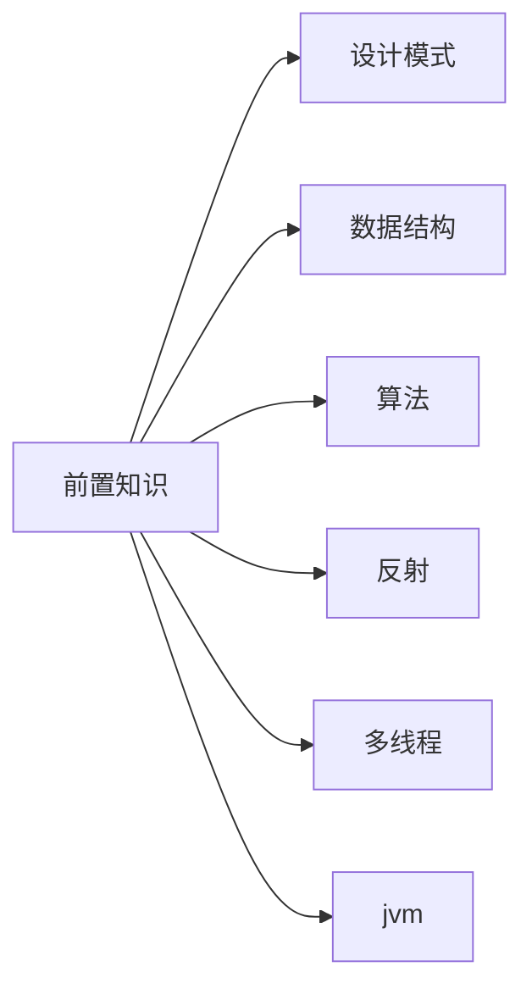

## 阅读源码的方法论

1. pre-knowledge


```mermaid
graph LR
前置知识 --> 设计模式 & 数据结构 & 算法 & 反射 & 多线程 & jvm
```

2. 注意点

   - 不要过于关于细节： 先流程
   - 看注释: 接口, 方法, 类
   - 见名知意
   - 大胆猜测, 小心验证
   - **画图: 时序图, 类图, 结构图**

   ```mermaid
   graph LR
   spring --> IOC & AOP
   ```
